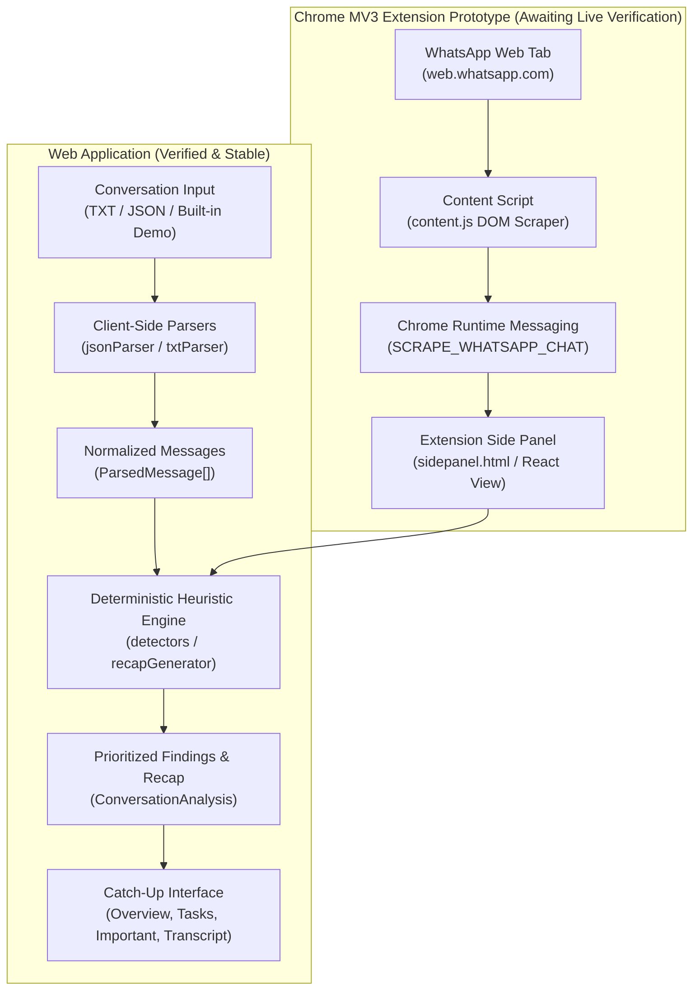

# What Did I Miss? (Missed.)

> **Catch up on unread group chats and incident channels in seconds — 100% on-device, deterministic, and instant.**

[](#privacy--security-boundary)
[](#architecture)
[](#honest-analysis-disclosure)
[](#tech-stack)
[-brightgreen)](#testing--verification)
[](#chrome-extension-installation-manifest-v3)

---

## The Problem: The Unread Backlog

When software engineers, team leads, on-call responders, and managers step away for focused sprints, cross-team meetings, or time off, they routinely return to hundreds of unread messages across incident channels, project threads, and group chats.

Reading through conversational noise sequentially is slow, exhausting, and error-prone. Critical architectural decisions, P0 production blockers, assigned action items, and tight deadlines get buried beneath status banter and emoji reactions.

### Intended Users
- **Engineers & On-Call Responders:** Quickly triage incident war-rooms, post-incident cutovers, and deployment updates.
- **Engineering Managers & Tech Leads:** Extract decisions, commitments, and task ownership without reading every thread.
- **Cross-Functional Teammates:** Filter conversations specifically for their own mentions and assigned action items.

### The Solution: Missed.
**What Did I Miss?** (branded as **Missed.**) analyzes chat exports or active web conversation views entirely inside the browser. Using transparent, deterministic pattern matching, it triages conversational history into an actionable executive recap, prioritized alerts, decisions, interactive task checklists, and deadline trackers—linking every single finding directly back to its exact source message in the timeline.

---

## Feature Highlights

- **Compact Catch-Up Interface:** Engineered for a 380px extension side-panel width with responsive desktop split-screen capability for full-browser reviews.
- **Instant Built-In Incident Demo:** Boots immediately with the *"Payment Gateway Migration Cutover"* scenario (14 realistic messages across 4 teammates), enabling instant evaluation without requiring uploaded files.
- **Multi-Format Export Ingestion:** Drag-and-drop or file-picker upload for `.txt` and `.json` chat exports (WhatsApp, Slack, bracketed timestamps, and generic transcripts) up to 10MB.
- **Deterministic Heuristic Extraction:**
  - **Executive Recap:** Message count, active contributors, conversation duration, and dominant topical keywords.
  - **Urgent & Blocker Alerts:** Surfaces critical blockers, rollback triggers, latency spikes, and P0 incident markers.
  - **Key Decisions:** Detects architectural sign-offs, consensus statements, and confirmed choices.
  - **Action Items & Task Checklist:** Identifies assigned tasks and commitments with interactive completion checkboxes.
  - **Deadlines & Time Targets:** Flags temporal commitments (EOD, specific hours, dates).
  - **Mentions & Direct Inquiries:** Isolates `@username` callouts and open questions.
- **Urgency & Relevance Priority Scoring:** Automatically triages findings into `High` (P0/blockers), `Medium` (tasks/decisions), and `Low` (mentions/notes) priority tiers.
- **Source-Message Deep Linking:** Every finding card links directly to its source message. Clicking a finding scrolls the timeline to the message and pulses a highlight ring (or opens the inspection drawer in side-panel mode).
- **Search & Participant Filtering:** Search across finding snippets, titles, senders, and assignees, or filter by specific participants.
- **Summary Export:** One-click "Copy Summary" generates a formatted Markdown digest containing recap bullets, decisions, and GitHub-flavored markdown task checklists (`[ ]` / `[x]`).
- **100% Client-Side Architecture:** Zero backend servers, zero telemetry scripts, and zero cloud LLM API calls. Your conversations never leave your device.

---

## Honest Analysis Disclosure

> [!NOTE]
> **Deterministic Rule-Based Heuristics (Not Generative AI):**  
> This application uses transparent, deterministic regular expressions, keyword tokenization, and pattern matching running locally in JavaScript. It **does not** claim to use generative artificial intelligence, neural networks, or cloud-based LLM inference. All insights are generated deterministically and linked directly to verifiable source messages in the transcript.

---

## Architecture

The system operates as a zero-backend, client-side application with two consumption modes: the standalone web application and the Manifest V3 Chrome extension prototype.



### Architectural Boundaries
1. **Web Application Pipeline (Fully Implemented & Verified):**  
   Files are ingested through browser `FileReader` APIs, parsed into normalized `ParsedMessage` models, processed by the heuristic analysis pipeline in memory, and rendered via modular React components.
2. **Extension Prototype Pipeline (Structural Implementation):**  
   A Manifest V3 extension package is provided in `extension/` with a service worker, side panel, and content script. The content script queries WhatsApp Web DOM selectors (`div[role="row"]`, `data-pre-plain-text`). While message passing and error states are implemented, live end-to-end extraction against an authenticated WhatsApp Web session remains an **unverified prototype** pending user testing.

---

## Tech Stack

| Layer | Technology | Details / Rationale |
| :--- | :--- | :--- |
| **Frontend Framework** | React 19 (`react`, `react-dom`) | Modern component architecture, functional hooks, memoized analysis pipelines |
| **Language** | TypeScript 5.8+ | Strict type checking across message models, parsers, and findings |
| **Build Tool & Bundler** | Vite 8 | Fast ESM development server and optimized production packaging |
| **Styling** | Tailwind CSS v4 (`@tailwindcss/vite`) | Utility-first styling with WhatsApp-inspired neutral aesthetics |
| **Icons** | Lucide React (`lucide-react`) | Lightweight SVG icons for priorities, tabs, and action states |
| **Browser Extension** | Chrome Manifest V3 | Side panel integration (`sidePanel`), active tab messaging (`scripting`) |
| **Automated Testing** | Node.js Test Runner (`node:test`) | Native Node test runner with `--experimental-strip-types` (zero test dependencies) |
| **Static Analysis** | Oxlint (`oxlint`) | Ultra-fast Rust-based linter with 116 rules |
| **Backend & Database** | None | 100% Client-Side. No remote server, database, or analytics |

---

## Quick-Start Guide

### Prerequisites
- Node.js (v20 or higher recommended, Node v24 supported)
- npm (v10 or higher)

### Setup & Development

#### Windows (PowerShell)
```powershell
# Navigate to the frontend directory
cd frontend

# Install dependencies
npm install

# Start local development server
npm run dev

# Run unit tests
npm test

# Run linter
npm run lint

# Build for production
npm run build
```

#### macOS / Linux (Bash)
```bash
# Navigate to the frontend directory
cd frontend

# Install dependencies
npm install

# Start local development server
npm run dev

# Run unit tests
npm test

# Run linter
npm run lint

# Build for production
npm run build
```

Once `npm run dev` starts, open the local URL (typically `http://localhost:5173/`) in your browser to view the application.

---

## Chrome Extension Installation (Manifest V3)

The repository includes a ready-to-load Chrome Manifest V3 extension in the `extension/` directory.

### Installation Steps
1. Open Google Chrome and navigate to `chrome://extensions/`.
2. Turn on **Developer mode** using the toggle switch in the top right corner.
3. Click the **Load unpacked** button in the top left corner.
4. Select the `extension/` folder in this repository:
   ```text
   What-Did-I-Miss/extension/
   ```
5. Click Chrome's **Side Panel** icon (or pin and click the **Missed.** icon in your extension toolbar) to open the Missed. side panel.

### Extension Verification Status & Troubleshooting
> [!IMPORTANT]
> **Prototype Status Notice:**  
> The extension manifest, background service worker, side panel, and content script are structurally implemented. However, because WhatsApp Web's DOM classes and markup are minified and subject to unannounced changes by Meta, live in-browser extraction against an active WhatsApp Web tab is currently labeled as an **extension prototype awaiting live end-to-end verification**.

The content script handles the following states gracefully:
- **Logged-Out State (`NOT_LOGGED_IN`):** Detected if WhatsApp Web displays a QR login screen. The extension prompts the user to log in before catching up.
- **No Active Conversation (`NO_ACTIVE_CHAT`):** Detected if no chat thread is open. The extension prompts the user to select a chat.
- **Empty Message Viewport (`NO_MESSAGES`):** Detected if no message rows are rendered in the DOM.
- **Fallback Demonstration:** At any time, you can click **"Load Demo"** in the extension header to explore the catch-up experience using the built-in incident dataset.

---

## Supported Import Formats

The application accepts both `.json` and `.txt` files up to 10MB in size:

### 1. JSON Exports
- **Standard Array:** Array of objects with `sender`, `text`, and optional `timestamp` / `id`.
  ```json
  [
    {
      "sender": "Maya",
      "text": "CRITICAL: Payment gateway migration failed. Latency spiked to 2.4s.",
      "timestamp": "2026-10-09T09:15:00Z"
    },
    {
      "sender": "Devon",
      "text": "Action item: @Elena please initiate the rollback runbook immediately.",
      "timestamp": "2026-10-09T09:16:30Z"
    }
  ]
  ```
- **Envelope Object:** Top-level object containing a `messages`, `conversation`, or `data` array.
  ```json
  {
    "channel": "incident-war-room",
    "messages": [
      { "sender": "Liam", "text": "Decision: Rollback approved by consensus." }
    ]
  }
  ```
- **Slack Export JSON:** Arrays with epoch timestamps (`ts`), message text (`text`), and user profiles (`user_profile.real_name`).

### 2. TXT Exports
- **Bracketed Timestamps:**
  ```text
  [2026-10-09 09:15:00] Maya: CRITICAL: Payment gateway migration failed.
  [2026-10-09 09:16:30] Devon: Action item: verify rollback by 10 AM.
  ```
- **WhatsApp Chat Exports:**
  ```text
  10/09/26, 09:15 AM - Maya: CRITICAL: Latency spike detected.
  10/09/26, 09:16 AM - Liam: Approved rollback plan.
  ```
- **Simple Colon Format:**
  ```text
  Maya: Rollback is complete.
  Devon: Please run smoke tests before EOD.
  ```
- **Multi-Line Continuations:** Lines lacking a leading timestamp or sender header are automatically appended to the preceding message body.

---

## Privacy & Security Boundary

- **100% In-Browser Execution:** File parsing, regex pattern matching, and priority scoring execute entirely inside the user's browser runtime.
- **No Remote Telemetry or Backend:** Zero network requests are dispatched to external servers, cloud databases, or third-party AI APIs.
- **Ephemeral State:** All conversation data and generated findings exist only in volatile React component state and are discarded upon page reload or tab closure.
- **Extension Permissions Rationale:**
  - `sidePanel`: Grants permission to render the catch-up companion interface in Chrome's side panel.
  - `activeTab` & `scripting`: Allows injecting the DOM scraper into the active tab upon user initiation.
  - `host_permissions: ["https://web.whatsapp.com/*"]`: Restricted strictly to WhatsApp Web. The extension cannot inspect or read any other domain or browsing history.

---

## Testing & Verification

The project includes an automated unit test suite verifying parsers, heuristics, and source-message integrity.

### Automated Test Suite (`frontend/tests/`)
Tests run using the native Node.js test runner (`node:test`) with TypeScript type-stripping (`--experimental-strip-types`), eliminating heavyweight external testing dependencies:

```bash
npm test
```

#### Actual Test Results (21 passing tests across 4 suites)
```text
✔ detectUrgency - identifies critical and blocker keywords (1.8ms)
✔ detectDecision - identifies approval and consensus statements (0.5ms)
✔ detectDeadline - extracts due dates and times (0.8ms)
✔ detectActionItem - extracts tasks and assignees (0.9ms)
✔ detectMention - identifies direct @mentions and queries (0.2ms)
✔ analyzeConversation - aggregates findings and generates recap stats (2.0ms)
✔ parseJsonContent - valid array of messages (2.1ms)
✔ parseJsonContent - envelope object with messages array (0.4ms)
✔ parseJsonContent - Slack export format with epoch ts and user_profile (1.9ms)
✔ parseJsonContent - missing timestamps triggers non-blocking warning (0.3ms)
✔ parseJsonContent - malformed JSON (0.3ms)
✔ parseJsonContent - empty string and whitespace (0.2ms)
✔ parseJsonContent - empty array (0.2ms)
✔ sourceLinking - all findings in sample conversation link to valid source messages (4.8ms)
✔ sourceLinking - maintains message link fidelity across custom message streams (0.5ms)
✔ parseTxtContent - bracketed timestamps with sender (1.5ms)
✔ parseTxtContent - WhatsApp format export (0.5ms)
✔ parseTxtContent - Simple colon format without timestamps (0.4ms)
✔ parseTxtContent - Multi-line message continuation (0.3ms)
✔ parseTxtContent - Empty file (0.1ms)
✔ parseTxtContent - Plain unstructured text fallback (0.1ms)

ℹ tests 21 | pass 21 | fail 0 | cancelled 0 | duration ~238ms
```

### Static Analysis & Build Verification
- **Linter (`oxlint`):** `Found 0 warnings and 0 errors across 34 files with 116 rules.`
- **Production Build (`tsc -b && vite build`):** Clean compilation producing optimized static bundles in `frontend/dist/`.

---

## Known Limitations & Roadmap

### Current Limitations
1. **Deterministic Heuristics vs. Generative Nuance:** Keyword and regex matching deliver ultra-fast, privacy-preserving extraction, but cannot detect subtle conversational nuances, indirect sarcasm, or implied commitments that lack explicit trigger words.
2. **WhatsApp Web DOM Brittleness:** The extension scraper relies on standard ARIA roles (`role="row"`) and data attributes. Upstream updates to WhatsApp Web markup may require selector maintenance.
3. **Single Active Chat Scope:** Ingests and triages one conversation transcript or open chat view at a time; cross-channel aggregated prioritization is not yet supported.

### Roadmap
- [ ] **Local WebAssembly Language Models:** Experiment with client-side small language models (via WebGPU / ONNX) for semantic summarization without compromising on-device privacy.
- [ ] **Multi-Platform Scrapers:** Extend content script prototypes to Slack Web, Discord Web, and Microsoft Teams Web.
- [ ] **Custom Priority Rules:** Allow users to define custom keywords, project tags, and custom alert phrases.

---

## Project Structure

```text
What-Did-I-Miss/
├── docs/
│   ├── ARCHITECTURE.md          # System architecture, data flow & trade-offs
│   ├── REQUIREMENTS.md          # Product requirements (P0/P1/P2 specification)
│   ├── AI_CONTEXT.md            # Hackathon project context & constraints
│   └── API.md                   # Internal data contracts documentation
├── extension/                   # Chrome Manifest V3 extension package
│   ├── icons/                   # Extension icons (16px, 48px, 128px)
│   ├── background.js            # Background service worker & side panel launcher
│   ├── content.js               # WhatsApp Web DOM scraper & highlight injector
│   ├── manifest.json            # Manifest V3 configuration & permissions
│   ├── sidepanel.css            # Extension side panel companion styles
│   ├── sidepanel.html           # Side panel companion markup
│   └── sidepanel.js             # Side panel controller & messaging bridge
├── frontend/                    # Web application frontend
│   ├── src/
│   │   ├── components/          # Modular React UI components
│   │   │   ├── AboutModal.tsx       # Architecture & privacy disclosure modal
│   │   │   ├── CompactFilter.tsx    # Search input and sender filter controls
│   │   │   ├── ConversationBar.tsx  # Active chat metadata and action bar
│   │   │   ├── Dropzone.tsx         # Drag-and-drop file ingestion area
│   │   │   ├── ErrorBanner.tsx      # Resilient error and warning alert banners
│   │   │   ├── ImportantView.tsx    # P0 alerts, blockers, decisions & deadlines
│   │   │   ├── MissedHeader.tsx     # App header, privacy badges & actions
│   │   │   ├── NavigationTabs.tsx   # Overview, Tasks, and Important tab bar
│   │   │   ├── OverviewView.tsx     # Executive recap stats, bullets & preview
│   │   │   ├── SourceDrawer.tsx     # Side-panel source message inspection drawer
│   │   │   ├── SummaryCounters.tsx  # Urgency, tasks, decisions & count metrics
│   │   │   ├── TasksView.tsx        # Interactive task checklist with checkboxes
│   │   │   └── TranscriptViewer.tsx # Message timeline with deep-link highlighting
│   │   ├── data/
│   │   │   └── sampleConversation.ts # Built-in incident dataset
│   │   ├── heuristics/          # Deterministic analysis engine
│   │   │   ├── analyzer.ts          # Core analysis coordinator & scoring
│   │   │   ├── detectors.ts         # Regex detector functions
│   │   │   └── recapGenerator.ts    # Topical summary & bullet generator
│   │   ├── parsers/             # Resilient chat export parsers
│   │   │   ├── index.ts             # Parser entry point & format router
│   │   │   ├── jsonParser.ts        # JSON array, envelope & Slack parser
│   │   │   └── txtParser.ts         # WhatsApp, bracketed & TXT parser
│   │   ├── types/               # TypeScript interfaces & data contracts
│   │   ├── App.tsx              # Application layout & state coordinator
│   │   └── main.tsx             # React entry point
│   ├── tests/                   # Automated unit test suite
│   │   ├── heuristics.test.ts   # Heuristic detector & scoring unit tests
│   │   ├── jsonParser.test.ts   # JSON parser & malformed file tests
│   │   ├── sourceLinking.test.ts# Source message deep-linking verification
│   │   └── txtParser.test.ts    # TXT parser & continuation tests
│   ├── package.json             # Scripts & dependencies
│   └── vite.config.ts           # Vite bundler configuration
├── .env.example                 # Environment variables template
├── .gitignore                   # Git ignore specifications
├── AI_INSTRUCTIONS.md           # Development guidelines & constraints
├── prompt.md                    # Prompt log
└── README.md                    # Project documentation
```

---

## Contributing & License

### Contributing
Contributions and suggestions are welcome! To contribute:
1. Fork the repository.
2. Create a feature branch: `git checkout -b feature/my-feature`.
3. Ensure all tests and linter checks pass: `npm test && npm run lint`.
4. Commit your changes with descriptive commit messages.
5. Submit a pull request.

### Documentation
- [Requirements Specification](docs/REQUIREMENTS.md)
- [Architecture & Design Guide](docs/ARCHITECTURE.md)
- [AI Context Documentation](docs/AI_CONTEXT.md)
- [API & Contracts Guide](docs/API.md)

### License
This project is an open-source hackathon prototype developed for the *Unread Problem* challenge. It is provided as-is under open hackathon development terms.
