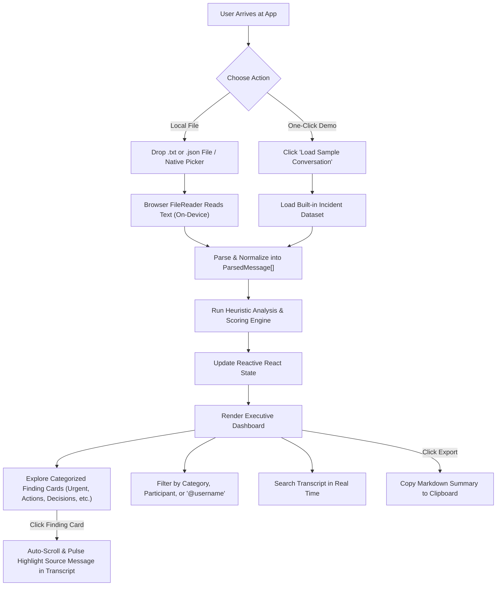
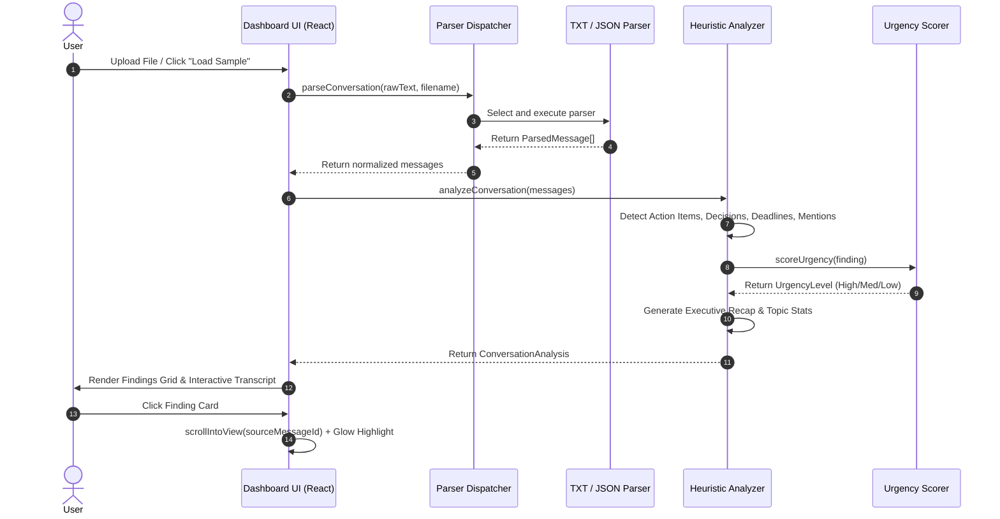

# ARCHITECTURE — What Did I Miss?

## 1. Project

**Project Name:** What Did I Miss?  
**Repository:** `What-Did-I-Miss`  
**Application Type:** Single-Page Web Application (SPA)  
**Primary Execution Model:** 100% Client-Side In-Browser Processing (Zero-Backend)  
**Target Environment:** Modern Web Browsers (Chrome, Edge, Firefox, Safari)

---

## 2. Problem

**The Challenge:** The Unread Problem — Information Overload in Team Chat Channels.  
Knowledge workers returning from absences or focused work face long streams of unread chat messages across Slack, Teams, WhatsApp, and Discord. Reading sequentially is slow, and critical information — such as blockers, decisions, deadlines, and assigned tasks — is easily overlooked.

**The Solution:**  
A lightweight, privacy-preserving web dashboard that imports exported chat files or loads an instant sample conversation, normalizes the messages, and runs deterministic rule-based NLP heuristics to extract and prioritize key insights:
- **Concise Executive Recap**
- **Action Items & Task Assignments**
- **Key Decisions**
- **Deadlines & Dates**
- **Urgent / Blocker Alerts**
- **Mentions & Addressed Questions**

Every insight is prioritized by urgency/relevance and deep-linked directly to the source message in the conversation timeline.

---

## 3. Users

1. **Busy Engineers & Leads:** Catching up on incident triage channels, deployment war rooms, or project planning threads after being offline.
2. **Product Managers & Scrum Masters:** Extracting decisions, blockers, and assigned action items without reading hundreds of chat messages.
3. **Privacy-Conscious Professionals:** Organizations that prohibit uploading proprietary chat logs to external cloud AI APIs or unknown servers.
4. **Hackathon Evaluators:** Looking for an immediate, responsive, working demo with zero setup overhead or API key configuration.

---

## 4. Core User Flow



---

## 5. Frontend Architecture

### 5.1. Tech Stack
- **Framework:** React 19 (`react`, `react-dom`)
- **Build Tool:** Vite 8 (Fast HMR, optimized static build)
- **Language:** TypeScript 5.8+ (Strict type safety across data pipelines)
- **Styling:** Tailwind CSS v4 (`@tailwindcss/vite`)
- **Icons:** Lucide React (`lucide-react`)
- **Routing:** Single-page view with reactive modal/split-pane layout

### 5.2. Modular Directory Structure
```text
frontend/src/
├── assets/                  # Static assets and icons
├── components/              # Modular UI Presentation
│   ├── layout/
│   │   ├── Header.tsx       # Branding, privacy badge, reset, copy actions
│   │   └── Footer.tsx       # Attribution & tech stack footer
│   ├── import/
│   │   ├── Dropzone.tsx     # Drag-and-drop file target + file input
│   │   └── FormatGuide.tsx  # Collapsible documentation of supported formats
│   ├── dashboard/
│   │   ├── RecapCard.tsx    # High-level stats, participants, top topics
│   │   ├── FilterBar.tsx    # Category pills, search bar, personalized filter
│   │   ├── FindingsList.tsx # List of categorized insight cards
│   │   └── FindingCard.tsx  # Card with category badge, urgency pill, source jump
│   ├── transcript/
│   │   ├── TranscriptViewer.tsx # Virtualized/scrollable message list
│   │   └── MessageRow.tsx       # Individual message with deep-link highlight
│   └── common/
│       ├── Badge.tsx        # Urgency & category badges
│       └── ErrorBanner.tsx  # Graceful error alerts
├── data/
│   └── sampleConversation.ts # Built-in realistic incident catch-up conversation
├── heuristics/              # Deterministic Pattern & Analysis Engine
│   ├── actionItemDetector.ts# Imperative verbs, TODOs, assignments
│   ├── decisionDetector.ts  # Approvals, consensus, agreements
│   ├── deadlineDetector.ts  # Temporal expressions, dates, EOD
│   ├── urgencyDetector.ts   # Critical keywords, P0 alerts, blockers
│   ├── mentionDetector.ts   # @mentions and direct queries
│   ├── recapGenerator.ts    # Topic extraction, summary bullet synthesis
│   └── analyzer.ts          # Orchestrator aggregating findings & scoring
├── parsers/                 # Normalization & File Ingestion
│   ├── jsonParser.ts        # Parses array, object envelope, Slack JSON
│   ├── txtParser.ts         # Bracketed, WhatsApp, and simple colon formats
│   └── index.ts             # File type detection and parser dispatch
├── types/                   # Unified TypeScript Contracts
│   ├── conversation.ts      # ParsedMessage, RawMessage interfaces
│   └── analysis.ts          # FindingItem, UrgencyLevel, ConversationAnalysis
├── App.tsx                  # Root state coordinator
├── main.tsx                 # Entry point
└── index.css                # Tailwind styling
```

### 5.3. State Management
- **In-Memory Reactive State:** All state is handled cleanly via standard React hooks (`useState`, `useMemo`, `useCallback`, `useRef`).
- **No Complex External Stores:** No Redux or Zustand needed; keeping the app lightweight and zero-dependency.
- **Deep-Link Ref Map:** A `useRef<Map<string, HTMLDivElement>>` maps `messageId` to DOM elements for instant smooth-scrolling (`element.scrollIntoView({ behavior: 'smooth', block: 'center' })`) and CSS pulse highlight.

---

## 6. Backend Architecture

- **Status:** **Zero-Backend (Client-Only).**
- **Rationale for MVP:**
  1. **Strict Privacy:** Chat logs never travel over HTTP or leave the user's computer.
  2. **Zero Latency:** Parsing and heuristics complete in tens of milliseconds in-browser.
  3. **Zero Infrastructure:** No servers, no database provisioning, no deployment failures.
  4. **Hackathon Velocity:** Allows 100% of engineering effort to be dedicated to parser resilience, heuristic accuracy, and visual polish.

---

## 7. Database Design

- **Status:** **Zero-Database (Ephemeral In-Memory).**
- Conversation exports are loaded into JavaScript memory during the browser session.
- **Session Cleanup:** Closing the tab or clicking "Clear / New File" completely wipes the conversation from memory.
- **Optional Local Storage:** Only non-sensitive preferences (e.g., collapsed UI states) may be stored in `localStorage`. Chat text is **never** persisted to persistent disk storage.

---

## 8. APIs & Internal Module Contracts

Because there are no network endpoints, all operations are structured as strictly typed, pure TypeScript functional interfaces:

### 8.1. Parser Contract (`src/parsers/index.ts`)
```typescript
export interface ParseResult {
  success: boolean;
  messages: ParsedMessage[];
  formatDetected?: 'json_standard' | 'json_slack' | 'txt_bracketed' | 'txt_whatsapp' | 'txt_simple';
  error?: string;
  warnings?: string[];
}

export function parseConversation(content: string, fileName: string): ParseResult;
```

### 8.2. Heuristic Analysis Contract (`src/heuristics/analyzer.ts`)
```typescript
export interface AnalysisOptions {
  userFilter?: string; // Optional user name/handle for personalized filter
}

export function analyzeConversation(
  messages: ParsedMessage[],
  options?: AnalysisOptions
): ConversationAnalysis;
```

### 8.3. Deep Linking Contract
```typescript
export type JumpToMessageFn = (messageId: string) => void;
```

---

## 9. External Services & Cloud APIs

- **External Services:** **None.**
- No OpenAI, Google Gemini, or Anthropic API endpoints.
- No analytics trackers or CDN script tags.
- The application is fully capable of running completely offline without an active internet connection after initial static asset load.

---

## 10. Data Flow & Processing Pipeline



---

## 11. Deployment Plan

- **Target Architecture:** Static Web Application (Single-Page Application).
- **Build Output:** Static HTML, JavaScript, and CSS bundle via `vite build` into `frontend/dist/`.
- **Hosting Options:**
  - Local browser preview via `npm run preview`.
  - Static hosting on GitHub Pages, Vercel, Netlify, or Cloudflare Pages.
- **Environment Variables:** None required for MVP.

---

## 12. Important Technical Decisions

### Decision 1: Transparent Rule-Based Heuristics over Remote Generative AI
- **Context:** The challenge is summarizing chat messages on a strict hackathon timeline without privacy breaches.
- **Decision:** Build a deterministic rule-based NLP extraction engine using curated regular expressions, linguistic cues, and lexical keyword weights.
- **Tradeoff & Mitigation:**
  - *Pros:* 100% private, 0ms network latency, $0 cost, zero API key requirements, 100% deterministic, transparent, and debuggable.
  - *Tradeoff:* Cannot perform open-ended abstractive synthesis like an LLM.
  - *Mitigation:* Explicitly label the feature as "Deterministic Heuristic Analysis" in the UI. Deliver superior structure: categorized findings, urgency scoring, and exact source message jump links.

### Decision 2: 100% Client-Side In-Browser Execution
- **Context:** Deciding between a Python/FastAPI backend vs. purely in-browser React.
- **Decision:** Run all parsing and analysis directly in the browser via JavaScript.
- **Rationale:** Meets the strict privacy requirement ("Keep conversation contents and summaries on-device. Do not upload them to a backend or remote AI API"). Simplifies deployment to a single static bundle.

### Decision 3: Standard Internal Message Representation (`ParsedMessage`)
- **Context:** Chat exports come in diverse shapes (Slack JSON, WhatsApp text, bracketed timestamps, raw logs).
- **Decision:** Isolate all formatting variations at the ingestion boundary and normalize everything into `ParsedMessage`.
- **Rationale:** All downstream heuristic extractors, search filters, and UI renderers depend solely on the normalized schema, making new format additions straightforward.

### Decision 4: Source Message Deep Linking via DOM Refs
- **Context:** Users need immediate context verification for any extracted finding.
- **Decision:** Every `FindingItem` retains `sourceMessageId`. Clicking a card triggers smooth DOM scrolling to the corresponding message in the transcript with a temporary CSS highlight ring.
- **Rationale:** Builds trust by showing users the exact source behind every extracted insight.

### Decision 5: Zero Added Dependencies Policy
- **Context:** Existing frontend has `react`, `react-dom`, `lucide-react`, `tailwindcss`, `recharts`, `react-router-dom`.
- **Decision:** Do not install additional npm packages. Use existing libraries and native browser APIs (e.g., native `FileReader`, `crypto.randomUUID()`, `navigator.clipboard`).

---

## 13. Privacy Boundaries & Security Model

```text
+--------------------------------------------------------------------------+
| USER'S BROWSER SANDBOX                                                   |
|                                                                          |
|   +-----------------------+       +----------------------------------+   |
|   | Local File / Sample   | ----> | FileReader (In-Memory ArrayBuffer)|   |
|   +-----------------------+       +----------------------------------+   |
|                                                     |                    |
|                                                     v                    |
|                                   +----------------------------------+   |
|                                   | Parsers & Normalization Engine   |   |
|                                   +----------------------------------+   |
|                                                     |                    |
|                                                     v                    |
|                                   +----------------------------------+   |
|                                   | Heuristic Extraction & Scoring   |   |
|                                   +----------------------------------+   |
|                                                     |                    |
|                                                     v                    |
|                                   +----------------------------------+   |
|                                   | React State & DOM Rendering      |   |
|                                   +----------------------------------+   |
+--------------------------------------------------------------------------+
                     ||  (NO OUTBOUND NETWORK REQUESTS)
                     \/
             [ EXTERNAL INTERNET ] (Completely isolated)
```

- **Data Confinement:** User data never leaves the JavaScript virtual machine heap.
- **Network Isolation:** No network requests are made for message processing or analysis.
- **Export Safety:** "Copy Summary" utilizes the browser's local `navigator.clipboard.writeText()` API.

---

## 14. Error Handling & Edge Case Strategy

1. **Empty Files:** Checks file length before reading; displays non-blocking warning without crashing.
2. **Invalid / Broken JSON:** Trapped via `try { JSON.parse() } catch { ... }` with guidance to check syntax or use text format.
3. **Missing Timestamps:** Parser assigns sequential order indices; UI displays a neutral "Time not specified" indicator.
4. **Unformatted Text:** Fallback parser groups non-empty lines into sequential messages with generic sender labels.
5. **Multi-line Messages:** TXT parser checks for header regex; non-matching lines append to the preceding message body.

---

## 15. Implementation Plan (3h 45m Competition Timeline)

- **Phase 1 (0:00 – 0:30): Architecture, Types & Sample Dataset**
  - Finalize TypeScript types in `types/`.
  - Implement realistic incident catch-up conversation dataset (`data/sampleConversation.ts`).
- **Phase 2 (0:30 – 1:15): Resilient Ingestion & Parsers**
  - Build `txtParser.ts` (Bracketed, WhatsApp, Simple colon).
  - Build `jsonParser.ts` (Array, Object with messages, Slack export).
  - Build `parsers/index.ts` dispatcher with format auto-detection.
- **Phase 3 (1:15 – 2:00): Heuristic Extraction & Prioritization**
  - Implement pattern matchers for Action Items, Decisions, Deadlines, Urgency, Mentions.
  - Implement multi-factor urgency scoring (`high`, `medium`, `low`).
  - Implement executive recap generator.
- **Phase 4 (2:00 – 2:45): Interactive Dashboard & Deep Linking**
  - Implement Dropzone with "Load Sample" button.
  - Implement Recap cards and Categorized Findings grid.
  - Implement Transcript Viewer with scroll-to-element and pulse highlight.
- **Phase 5 (2:45 – 3:15): Search, Filters & Export (P1 Features)**
  - Implement real-time text search across findings and messages.
  - Implement Category tabs, Participant filter, and "Filter for me".
  - Implement "Copy Summary to Clipboard".
- **Phase 6 (3:15 – 3:45): Verification, Error Handling & Final Polish**
  - Test all edge cases (empty file, malformed JSON, missing timestamps).
  - Polish layout, typography, colors, and badge contrast.
  - End-to-end demo dry run.